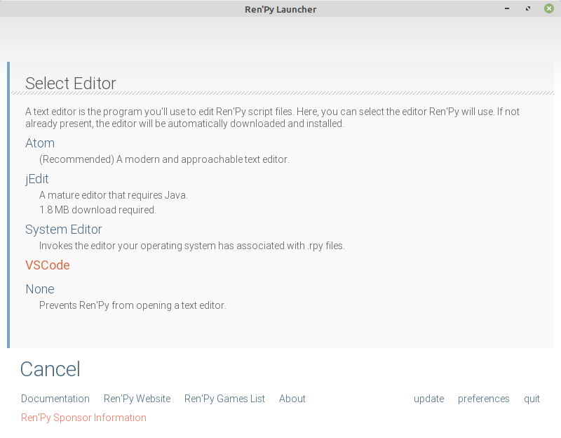

## RU
Ren'Py [позволяет](https://www.renpy.org/doc/html/editor.html "позволяет") интегрировать любой редактор с собственным лаунчером. Скрипт представленный в данном репозитории, добавляет возможность открывать проект и редактировать файлы в VSCode прямо из лаунчера Ren'Py.
## Как установить
1. Скачайте или склонируйте данный репозиторий(также можно просто скачать VSCode.edit.py отдельно);
2. Поместите файл VSCode.edit.py в директорию %renpy_sdk%/launcher, где %renpy_sdk% - папка с установленным Ren'Py;
3. Если вы всё сделали правильно, то в настройках Ren'Py появится возможность выбрать редактор VSCode.
